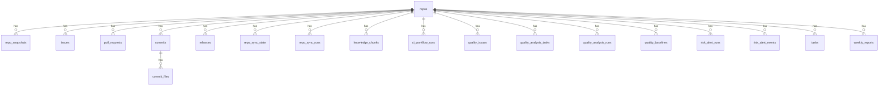

# 数据库设计说明书

## 1. 引言

### 1.1 编写目的
本文档描述「基于 AI 驱动的软件工程一体化度量与协作平台」的数据库结构设计，包括所有表的定义、字段说明、索引设计和表间关系。系统采用 **SQLite3** 作为嵌入式关系数据库。

### 1.2 数据库管理工具
- **数据库引擎**: SQLite 3.x
- **访问方式**: C++ SQLite3 API（参数化查询）
- **文件存储**: 由 `DEVINSIGHT_DB` 环境变量指定，默认 `data/devinsight.db`

---

## 2. 数据库整体架构



---

## 3. 数据表详细定义

### 3.1 repos — 仓库元信息表

```sql
CREATE TABLE repos (
    id              INTEGER PRIMARY KEY AUTOINCREMENT,
    full_name       TEXT NOT NULL UNIQUE,        -- "owner/repo" 格式
    enabled         INTEGER NOT NULL DEFAULT 1,  -- 1=启用, 0=禁用
    intro_text      TEXT NOT NULL DEFAULT '',     -- 仓库介绍文本（迁移列）
    intro_updated_at TEXT,                        -- 介绍文本更新时间
    created_at      TEXT NOT NULL DEFAULT (datetime('now'))
);
```

**用途**: 存储用户在平台注册的仓库元信息，其他表的 repo_id 均引用此表主键。

---

### 3.2 repo_sync_runs — 同步运行记录表

```sql
CREATE TABLE repo_sync_runs (
    id          INTEGER PRIMARY KEY AUTOINCREMENT,
    repo_id     INTEGER NOT NULL,
    started_at  TEXT NOT NULL DEFAULT (datetime('now')),
    finished_at TEXT,
    status      TEXT NOT NULL,      -- started / ok / error
    error       TEXT,
    FOREIGN KEY (repo_id) REFERENCES repos(id) ON DELETE CASCADE
);
CREATE INDEX idx_repo_sync_runs_repo_started ON repo_sync_runs(repo_id, started_at DESC);
```

---

### 3.3 repo_sync_state — 增量同步状态表

```sql
CREATE TABLE repo_sync_state (
    repo_id                INTEGER PRIMARY KEY,
    issues_updated_cursor  TEXT,    -- Issues 增量游标（updated_at）
    pulls_updated_cursor   TEXT,    -- PRs 增量游标（updated_at）
    commits_since_cursor   TEXT,    -- Commits 增量游标（committed_at）
    releases_cursor        TEXT,    -- Releases 游标（published_at）
    updated_at             TEXT NOT NULL DEFAULT (datetime('now')),
    FOREIGN KEY (repo_id) REFERENCES repos(id) ON DELETE CASCADE
);
```

---

### 3.4 repo_snapshots — 仓库快照表

```sql
CREATE TABLE repo_snapshots (
    id          INTEGER PRIMARY KEY AUTOINCREMENT,
    repo_id     INTEGER NOT NULL,
    ts          TEXT NOT NULL DEFAULT (datetime('now')),
    full_name   TEXT NOT NULL,
    stars       INTEGER NOT NULL,
    forks       INTEGER NOT NULL,
    open_issues INTEGER NOT NULL,
    watchers    INTEGER NOT NULL,
    pushed_at   TEXT,
    raw_json    TEXT,
    FOREIGN KEY (repo_id) REFERENCES repos(id) ON DELETE CASCADE
);
CREATE INDEX idx_repo_snapshots_repo_id_ts ON repo_snapshots(repo_id, ts);
```

---

### 3.5 issues — Issue 表

```sql
CREATE TABLE issues (
    id              INTEGER PRIMARY KEY AUTOINCREMENT,
    repo_id         INTEGER NOT NULL,
    number          INTEGER NOT NULL,          -- GitHub Issue 编号
    state           TEXT NOT NULL,              -- open / closed
    title           TEXT NOT NULL,
    created_at      TEXT NOT NULL,
    updated_at      TEXT NOT NULL,
    closed_at       TEXT,
    comments        INTEGER NOT NULL DEFAULT 0,
    author_login    TEXT,
    is_pull_request INTEGER NOT NULL DEFAULT 0, -- 1=该 issue 实际是 PR
    raw_json        TEXT NOT NULL,
    UNIQUE(repo_id, number),
    FOREIGN KEY (repo_id) REFERENCES repos(id) ON DELETE CASCADE
);
CREATE INDEX idx_issues_repo_state ON issues(repo_id, state);
```

---

### 3.6 pull_requests — PR 表

```sql
CREATE TABLE pull_requests (
    id           INTEGER PRIMARY KEY AUTOINCREMENT,
    repo_id      INTEGER NOT NULL,
    number       INTEGER NOT NULL,
    state        TEXT NOT NULL,       -- open / closed
    title        TEXT NOT NULL,
    created_at   TEXT NOT NULL,
    updated_at   TEXT NOT NULL,
    closed_at    TEXT,
    merged_at    TEXT,
    author_login TEXT,
    raw_json     TEXT NOT NULL,
    UNIQUE(repo_id, number),
    FOREIGN KEY (repo_id) REFERENCES repos(id) ON DELETE CASCADE
);
CREATE INDEX idx_prs_repo_merged ON pull_requests(repo_id, merged_at);
```

---

### 3.7 commits — Commit 表

```sql
CREATE TABLE commits (
    id            INTEGER PRIMARY KEY AUTOINCREMENT,
    repo_id       INTEGER NOT NULL,
    sha           TEXT NOT NULL,
    author_login  TEXT,
    committed_at  TEXT NOT NULL,
    raw_json      TEXT NOT NULL,
    UNIQUE(repo_id, sha),
    FOREIGN KEY (repo_id) REFERENCES repos(id) ON DELETE CASCADE
);
CREATE INDEX idx_commits_repo_time ON commits(repo_id, committed_at);
CREATE INDEX idx_commits_sha ON commits(sha);
```

---

### 3.8 commit_files — Commit 文件变更表

```sql
CREATE TABLE commit_files (
    id           INTEGER PRIMARY KEY AUTOINCREMENT,
    commit_id    INTEGER NOT NULL,
    sha          TEXT NOT NULL,
    filename     TEXT NOT NULL,
    additions    INTEGER NOT NULL DEFAULT 0,
    deletions    INTEGER NOT NULL DEFAULT 0,
    changes      INTEGER NOT NULL DEFAULT 0,
    committed_at TEXT NOT NULL,
    raw_json     TEXT NOT NULL,
    UNIQUE(commit_id, filename),
    FOREIGN KEY (commit_id) REFERENCES commits(id) ON DELETE CASCADE
);
CREATE INDEX idx_commit_files_commit ON commit_files(commit_id);
CREATE INDEX idx_commit_files_commit_time ON commit_files(commit_id, committed_at);
CREATE INDEX idx_commit_files_sha ON commit_files(sha);
```

---

### 3.9 releases — Release 表

```sql
CREATE TABLE releases (
    id           INTEGER PRIMARY KEY AUTOINCREMENT,
    repo_id      INTEGER NOT NULL,
    tag_name     TEXT NOT NULL,
    name         TEXT,
    draft        INTEGER NOT NULL DEFAULT 0,
    prerelease   INTEGER NOT NULL DEFAULT 0,
    published_at TEXT,
    raw_json     TEXT NOT NULL,
    UNIQUE(repo_id, tag_name),
    FOREIGN KEY (repo_id) REFERENCES repos(id) ON DELETE CASCADE
);
CREATE INDEX idx_releases_repo_published ON releases(repo_id, published_at);
```

---

### 3.10 knowledge_chunks — 知识块表

```sql
CREATE TABLE knowledge_chunks (
    id          INTEGER PRIMARY KEY AUTOINCREMENT,
    repo_id     INTEGER NOT NULL,
    source_type TEXT NOT NULL,     -- issue / pull_request / commit / release / code / repo_tree / expert / risk_alert
    source_id   TEXT NOT NULL,
    title       TEXT NOT NULL DEFAULT '',
    content     TEXT NOT NULL DEFAULT '',
    author      TEXT DEFAULT '',
    event_time  TEXT DEFAULT '',
    embedding   BLOB,              -- 向量嵌入（float32 字节序列）
    created_at  TEXT NOT NULL DEFAULT (datetime('now')),
    FOREIGN KEY (repo_id) REFERENCES repos(id) ON DELETE CASCADE
);
CREATE INDEX idx_kchunks_repo ON knowledge_chunks(repo_id);
CREATE INDEX idx_kchunks_source ON knowledge_chunks(repo_id, source_type, source_id);
```

**用途**: RAG 系统的核心数据表，存储从各种数据源提取的结构化知识块。

---

### 3.11 ai_conversations — AI 对话记录表

```sql
CREATE TABLE ai_conversations (
    id            INTEGER PRIMARY KEY AUTOINCREMENT,
    repo_id       INTEGER,
    question      TEXT NOT NULL,
    answer        TEXT NOT NULL,
    evidence_json TEXT,
    model         TEXT,
    created_at    TEXT NOT NULL DEFAULT (datetime('now'))
);
CREATE INDEX idx_ai_conv_repo ON ai_conversations(repo_id);
```

---

### 3.12 ci_workflow_runs — CI 运行记录表

```sql
CREATE TABLE ci_workflow_runs (
    id             INTEGER PRIMARY KEY AUTOINCREMENT,
    repo_id        INTEGER NOT NULL,
    run_id         INTEGER NOT NULL,        -- GitHub Run ID
    workflow_id    INTEGER NOT NULL DEFAULT 0,
    name           TEXT NOT NULL DEFAULT '',
    head_branch    TEXT NOT NULL DEFAULT '',
    event          TEXT NOT NULL DEFAULT '',
    status         TEXT NOT NULL DEFAULT '',  -- queued / in_progress / completed
    conclusion     TEXT NOT NULL DEFAULT '',  -- success / failure / cancelled
    created_at     TEXT NOT NULL DEFAULT '',
    updated_at     TEXT NOT NULL DEFAULT '',
    run_started_at TEXT NOT NULL DEFAULT '',
    html_url       TEXT NOT NULL DEFAULT '',
    actor_login    TEXT NOT NULL DEFAULT '',
    run_attempt    INTEGER NOT NULL DEFAULT 0,
    raw_json       TEXT NOT NULL DEFAULT '',
    inserted_at    TEXT NOT NULL DEFAULT (datetime('now')),
    UNIQUE(repo_id, run_id),
    FOREIGN KEY (repo_id) REFERENCES repos(id) ON DELETE CASCADE
);
CREATE INDEX idx_ci_runs_repo_created ON ci_workflow_runs(repo_id, created_at DESC);
CREATE INDEX idx_ci_runs_repo_status ON ci_workflow_runs(repo_id, status, conclusion);
CREATE INDEX idx_ci_runs_repo_updated ON ci_workflow_runs(repo_id, updated_at DESC);
```

---

### 3.13 system_operation_logs — 系统操作日志表

```sql
CREATE TABLE system_operation_logs (
    id              INTEGER PRIMARY KEY AUTOINCREMENT,
    created_at      TEXT NOT NULL DEFAULT (datetime('now')),
    operation_type  TEXT NOT NULL DEFAULT '',  -- repo_create / repo_sync / ai_ask 等
    target          TEXT NOT NULL DEFAULT '',  -- 操作目标标识
    status          TEXT NOT NULL DEFAULT 'ok', -- ok / error
    duration_ms     INTEGER NOT NULL DEFAULT 0,
    ip              TEXT NOT NULL DEFAULT '',
    detail_json     TEXT NOT NULL DEFAULT '{}'
);
CREATE INDEX idx_sys_ops_created ON system_operation_logs(created_at DESC);
CREATE INDEX idx_sys_ops_type_status ON system_operation_logs(operation_type, status);
```

---

### 3.14 system_ai_usage_logs — AI 用量日志表

```sql
CREATE TABLE system_ai_usage_logs (
    id               INTEGER PRIMARY KEY AUTOINCREMENT,
    created_at       TEXT NOT NULL DEFAULT (datetime('now')),
    repo_id          INTEGER,
    repo_full_name   TEXT NOT NULL DEFAULT '',
    model            TEXT NOT NULL DEFAULT '',
    prompt_tokens    INTEGER NOT NULL DEFAULT 0,
    completion_tokens INTEGER NOT NULL DEFAULT 0,
    total_tokens     INTEGER NOT NULL DEFAULT 0,
    cost_usd         REAL NOT NULL DEFAULT 0,
    duration_ms      INTEGER NOT NULL DEFAULT 0,
    ip               TEXT NOT NULL DEFAULT '',
    status           TEXT NOT NULL DEFAULT 'ok',
    error            TEXT NOT NULL DEFAULT '',
    FOREIGN KEY (repo_id) REFERENCES repos(id) ON DELETE SET NULL
);
CREATE INDEX idx_sys_ai_created ON system_ai_usage_logs(created_at DESC);
CREATE INDEX idx_sys_ai_repo_created ON system_ai_usage_logs(repo_id, created_at DESC);
```

---

### 3.15 quality_issues — 质量问题明细表

```sql
CREATE TABLE quality_issues (
    id               INTEGER PRIMARY KEY AUTOINCREMENT,
    repo_id          INTEGER NOT NULL,
    tool             TEXT NOT NULL,            -- cppcheck / clang-tidy / cpplint 等
    issue_key        TEXT NOT NULL DEFAULT '',  -- FNV1a 哈希，用于去重
    file_path        TEXT NOT NULL,
    line             INTEGER NOT NULL DEFAULT 0,
    column           INTEGER NOT NULL DEFAULT 0,
    rule_id          TEXT NOT NULL DEFAULT '',
    severity         TEXT NOT NULL DEFAULT '',  -- error / warning / style / performance / portability / information
    message          TEXT NOT NULL DEFAULT '',
    status           TEXT NOT NULL DEFAULT 'active',  -- active / fixed / ignored / false_positive
    first_seen_at    TEXT NOT NULL DEFAULT (datetime('now')),
    first_seen_run_id INTEGER NOT NULL DEFAULT 0,
    last_seen_run_id  INTEGER NOT NULL DEFAULT 0,
    last_seen_at     TEXT,
    fixed_at         TEXT,
    FOREIGN KEY (repo_id) REFERENCES repos(id) ON DELETE CASCADE
);
CREATE INDEX idx_quality_issues_repo_tool ON quality_issues(repo_id, tool);
CREATE INDEX idx_quality_issues_repo_file ON quality_issues(repo_id, file_path);
```

---

### 3.16 quality_analysis_tasks — 分析任务表

```sql
CREATE TABLE quality_analysis_tasks (
    id          INTEGER PRIMARY KEY AUTOINCREMENT,
    repo_id     INTEGER NOT NULL,
    branch      TEXT NOT NULL DEFAULT 'main',
    tools       TEXT NOT NULL DEFAULT 'cppcheck',
    mode        TEXT NOT NULL DEFAULT 'full',      -- full / hot
    max_files   INTEGER NOT NULL DEFAULT 2000,
    config_json TEXT NOT NULL DEFAULT '{}',
    schedule    TEXT NOT NULL DEFAULT 'manual',    -- manual / weekly / on_release
    status      TEXT NOT NULL DEFAULT 'Pending',   -- Pending / Running / Finished / Failed
    last_run_id INTEGER,
    created_at  TEXT NOT NULL DEFAULT (datetime('now')),
    updated_at  TEXT NOT NULL DEFAULT (datetime('now')),
    FOREIGN KEY (repo_id) REFERENCES repos(id) ON DELETE CASCADE
);
CREATE INDEX idx_quality_tasks_repo ON quality_analysis_tasks(repo_id, created_at DESC);
CREATE INDEX idx_quality_tasks_status ON quality_analysis_tasks(repo_id, status);
```

---

### 3.17 quality_analysis_runs — 分析运行记录表

```sql
CREATE TABLE quality_analysis_runs (
    id                    INTEGER PRIMARY KEY AUTOINCREMENT,
    task_id               INTEGER,
    repo_id               INTEGER NOT NULL,
    branch                TEXT NOT NULL DEFAULT 'main',
    tools                 TEXT NOT NULL DEFAULT '',
    mode                  TEXT NOT NULL DEFAULT 'full',
    max_files             INTEGER NOT NULL DEFAULT 0,
    status                TEXT NOT NULL DEFAULT 'Running',
    config_json           TEXT NOT NULL DEFAULT '{}',
    started_at            TEXT NOT NULL DEFAULT (datetime('now')),
    finished_at           TEXT,
    analyzed_files        INTEGER NOT NULL DEFAULT 0,
    lines_analyzed        INTEGER NOT NULL DEFAULT 0,
    issues_total          INTEGER NOT NULL DEFAULT 0,
    issues_new            INTEGER NOT NULL DEFAULT 0,
    issues_fixed          INTEGER NOT NULL DEFAULT 0,
    issues_by_severity_json TEXT NOT NULL DEFAULT '{}',
    score                 REAL NOT NULL DEFAULT 0,
    baseline_score        REAL,
    degraded              INTEGER NOT NULL DEFAULT 0,
    output_json           TEXT NOT NULL DEFAULT '{}',
    error                 TEXT NOT NULL DEFAULT '',
    FOREIGN KEY (repo_id) REFERENCES repos(id) ON DELETE CASCADE,
    FOREIGN KEY (task_id) REFERENCES quality_analysis_tasks(id) ON DELETE SET NULL
);
CREATE INDEX idx_quality_runs_repo_started ON quality_analysis_runs(repo_id, started_at DESC);
CREATE INDEX idx_quality_runs_task ON quality_analysis_runs(task_id, started_at DESC);
```

---

### 3.18 quality_run_issues — 运行问题关联表

```sql
CREATE TABLE quality_run_issues (
    id        INTEGER PRIMARY KEY AUTOINCREMENT,
    run_id    INTEGER NOT NULL,
    repo_id   INTEGER NOT NULL,
    tool      TEXT NOT NULL,
    issue_key TEXT NOT NULL DEFAULT '',
    file_path TEXT NOT NULL,
    line      INTEGER NOT NULL DEFAULT 0,
    column    INTEGER NOT NULL DEFAULT 0,
    rule_id   TEXT NOT NULL DEFAULT '',
    severity  TEXT NOT NULL DEFAULT '',
    message   TEXT NOT NULL DEFAULT '',
    created_at TEXT NOT NULL DEFAULT (datetime('now')),
    FOREIGN KEY (run_id) REFERENCES quality_analysis_runs(id) ON DELETE CASCADE,
    FOREIGN KEY (repo_id) REFERENCES repos(id) ON DELETE CASCADE
);
CREATE INDEX idx_quality_run_issues_run ON quality_run_issues(run_id);
CREATE INDEX idx_quality_run_issues_repo_tool ON quality_run_issues(repo_id, tool);
```

---

### 3.19 quality_baselines — 质量基线表

```sql
CREATE TABLE quality_baselines (
    repo_id          INTEGER PRIMARY KEY,
    min_score        REAL NOT NULL DEFAULT 80.0,
    max_new_issues   INTEGER NOT NULL DEFAULT 0,
    max_error_issues INTEGER NOT NULL DEFAULT 0,
    updated_at       TEXT NOT NULL DEFAULT (datetime('now')),
    FOREIGN KEY (repo_id) REFERENCES repos(id) ON DELETE CASCADE
);
```

---

### 3.20 risk_alert_runs — 风险扫描运行表

```sql
CREATE TABLE risk_alert_runs (
    id           INTEGER PRIMARY KEY AUTOINCREMENT,
    repo_id      INTEGER NOT NULL,
    started_at   TEXT NOT NULL DEFAULT (datetime('now')),
    finished_at  TEXT,
    status       TEXT NOT NULL DEFAULT 'running',
    summary_json TEXT,
    error        TEXT,
    FOREIGN KEY (repo_id) REFERENCES repos(id) ON DELETE CASCADE
);
```

---

### 3.21 risk_alert_events — 风险告警事件表

```sql
CREATE TABLE risk_alert_events (
    id              INTEGER PRIMARY KEY AUTOINCREMENT,
    run_id          INTEGER,
    repo_id         INTEGER NOT NULL,
    alert_type      TEXT NOT NULL,          -- code_churn_spike / issue_backlog_spike / pr_merge_latency_spike
    metric_name     TEXT NOT NULL,
    window_start    TEXT,
    window_end      TEXT,
    current_value   REAL NOT NULL,
    baseline_value  REAL NOT NULL,
    threshold_value REAL NOT NULL,
    severity        TEXT NOT NULL,          -- info / warning / critical
    scope_type      TEXT NOT NULL DEFAULT 'repo',
    scope_id        TEXT NOT NULL DEFAULT '',
    suggested_action TEXT,
    status          TEXT NOT NULL DEFAULT 'open',
    evidence_json   TEXT,
    created_at      TEXT NOT NULL DEFAULT (datetime('now')),
    FOREIGN KEY (run_id) REFERENCES risk_alert_runs(id) ON DELETE SET NULL,
    FOREIGN KEY (repo_id) REFERENCES repos(id) ON DELETE CASCADE
);
CREATE INDEX idx_risk_events_repo_created ON risk_alert_events(repo_id, created_at DESC);
CREATE INDEX idx_risk_events_repo_status ON risk_alert_events(repo_id, status, severity);
```

---

### 3.22 tasks — 改进任务表

```sql
CREATE TABLE tasks (
    id                INTEGER PRIMARY KEY AUTOINCREMENT,
    repo_id           INTEGER NOT NULL,
    title             TEXT NOT NULL,
    priority          TEXT NOT NULL DEFAULT 'P1',
    status            TEXT NOT NULL DEFAULT 'open',
    reason            TEXT NOT NULL DEFAULT '',
    actions_json      TEXT NOT NULL DEFAULT '[]',
    expected_benefit  TEXT NOT NULL DEFAULT '',
    verify            TEXT NOT NULL DEFAULT '',
    source            TEXT NOT NULL DEFAULT 'ai',
    ai_conversation_id INTEGER,
    created_at        TEXT NOT NULL DEFAULT (datetime('now')),
    done_at           TEXT,
    updated_at        TEXT NOT NULL DEFAULT (datetime('now')),
    UNIQUE(repo_id, title),
    FOREIGN KEY (repo_id) REFERENCES repos(id) ON DELETE CASCADE
);
CREATE INDEX idx_tasks_repo_status ON tasks(repo_id, status, priority);
CREATE INDEX idx_tasks_repo_created ON tasks(repo_id, created_at DESC);
```

---

### 3.23 weekly_reports — 周报表

```sql
CREATE TABLE weekly_reports (
    id          INTEGER PRIMARY KEY AUTOINCREMENT,
    repo_id     INTEGER NOT NULL,
    week_start  TEXT NOT NULL,
    week_end    TEXT NOT NULL,
    report_text TEXT NOT NULL,
    metrics_json TEXT,
    model       TEXT,
    created_at  TEXT NOT NULL DEFAULT (datetime('now')),
    FOREIGN KEY (repo_id) REFERENCES repos(id) ON DELETE CASCADE
);
CREATE INDEX idx_weekly_reports_repo ON weekly_reports(repo_id, created_at DESC);
```

---

## 4. 索引汇总

| 表名 | 索引名 | 列 | 用途 |
|------|--------|-----|------|
| repo_snapshots | idx_repo_snapshots_repo_id_ts | repo_id, ts | 按仓库+时间查询快照 |
| issues | idx_issues_repo_state | repo_id, state | 按仓库+状态过滤 |
| pull_requests | idx_prs_repo_merged | repo_id, merged_at | 按仓库+合并时间查询 |
| commits | idx_commits_repo_time | repo_id, committed_at | 按仓库+提交时间排序 |
| commits | idx_commits_sha | sha | 按 SHA 查找 |
| commit_files | idx_commit_files_commit | commit_id | 按 commit 查文件 |
| commit_files | idx_commit_files_commit_time | commit_id, committed_at | 按 commit+时间排序 |
| commit_files | idx_commit_files_sha | sha | 按 SHA 查找 |
| releases | idx_releases_repo_published | repo_id, published_at | 按仓库+发布时间排序 |
| knowledge_chunks | idx_kchunks_repo | repo_id | 按仓库检索知识块 |
| knowledge_chunks | idx_kchunks_source | repo_id, source_type, source_id | 按来源检索 |
| ai_conversations | idx_ai_conv_repo | repo_id | 按仓库查对话历史 |
| ci_workflow_runs | idx_ci_runs_repo_created | repo_id, created_at | CI 按创建时间排序 |
| ci_workflow_runs | idx_ci_runs_repo_status | repo_id, status, conclusion | CI 按状态过滤 |
| quality_issues | idx_quality_issues_repo_tool | repo_id, tool | 质量按工具过滤 |
| quality_issues | idx_quality_issues_repo_file | repo_id, file_path | 质量按文件查询 |
| risk_alert_events | idx_risk_events_repo_created | repo_id, created_at | 风险按时间排序 |
| risk_alert_events | idx_risk_events_repo_status | repo_id, status, severity | 风险按状态过滤 |
| tasks | idx_tasks_repo_status | repo_id, status, priority | 任务按状态+优先级排序 |
| tasks | idx_tasks_repo_created | repo_id, created_at | 任务按创建时间排序 |
| weekly_reports | idx_weekly_reports_repo | repo_id, created_at | 周报按时间排序 |

---

## 5. 数据库迁移策略

系统采用轻量级迁移方案，在 `init_schema()` 中使用 `CREATE TABLE IF NOT EXISTS` 确保表存在，然后通过 `ALTER TABLE ADD COLUMN` 逐步补充新列。

```cpp
// 迁移示例：向已有表中添加新列
if (!has_column(db_, "knowledge_chunks", "embedding")) {
    exec("ALTER TABLE knowledge_chunks ADD COLUMN embedding BLOB;");
}
```

**迁移记录**: 所有 ALTER TABLE 操作都包裹在 try-catch 中，确保在旧数据库上不会因列已存在而崩溃。

---

## 6. 外键关系总览

| 子表 | 外键列 | 引用表 | 级联删除 |
|------|--------|--------|:--------:|
| repo_snapshots | repo_id | repos | CASCADE |
| issues | repo_id | repos | CASCADE |
| pull_requests | repo_id | repos | CASCADE |
| commits | repo_id | repos | CASCADE |
| commit_files | commit_id | commits | CASCADE |
| releases | repo_id | repos | CASCADE |
| knowledge_chunks | repo_id | repos | CASCADE |
| ci_workflow_runs | repo_id | repos | CASCADE |
| system_ai_usage_logs | repo_id | repos | SET NULL |
| quality_issues | repo_id | repos | CASCADE |
| quality_analysis_tasks | repo_id | repos | CASCADE |
| quality_analysis_runs | repo_id | repos | CASCADE |
| risk_alert_runs | repo_id | repos | CASCADE |
| risk_alert_events | repo_id | repos | CASCADE |
| tasks | repo_id | repos | CASCADE |
| weekly_reports | repo_id | repos | CASCADE |

---

*文档版本: v2.0 | 日期: 2026年6月*
