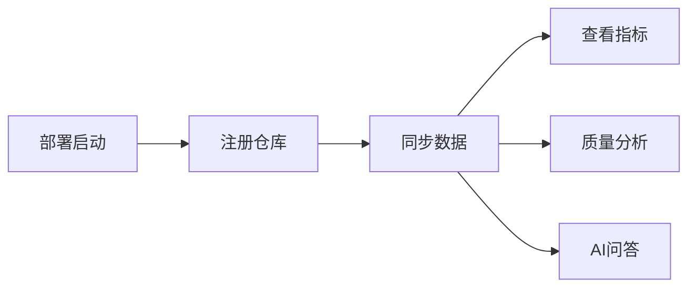

# 用户手册

## 1. 引言

### 1.1 系统简介
「基于 AI 驱动的软件工程一体化度量与协作平台」（DevInsight）是一款面向软件团队的工程管理工具。系统通过自动化数据采集、AI 分析和可视化展示，帮助团队快速掌握项目状况、发现潜在问题、提升工程质量。

**核心定位**:
> "让每个工程团队都能拥有 AI 驱动的度量与协作能力"

### 1.2 系统特点
- **一站式**: 集成度量、质量、AI、风险等能力
- **AI 驱动**: 智能问答、自动周报、专家发现
- **数据可视化**: 评分、趋势、热点一目了然
- **本地部署**: 数据不出域，安全可控
- **开源免费**: 无需商业许可

---

## 2. 快速入门

### 2.1 首次使用流程



**完成这三步，你就能使用全部功能**:

1. **部署**: 参照"操作手册"完成部署（约 5 分钟）
2. **注册仓库**: 输入 GitHub 仓库名（如 `owner/repo`）
3. **同步数据**: 点击同步，等待数据拉取完成

### 2.2 界面概览

登录后进入系统主页面，页面结构如下：

```
┌─────────────────────────────────────┐
│  DevInsight 平台          用户信息   │  ← 顶部导航
├──────────┬──────────────────────────┤
│          │                          │
│  仓库列表 │   主内容区域              │
│  AI 问答  │   (根据当前页面变化)      │
│  系统日志 │                          │
│          │                          │
├──────────┴──────────────────────────┤
│              版权信息                │  ← 底部
└─────────────────────────────────────┘
```

---

## 3. 功能详解

### 3.1 仓库管理

#### 仓库列表
仓库列表页面展示所有已注册的仓库，包含以下信息：

| 信息 | 说明 |
|------|------|
| 仓库名称 | owner/repo 格式的全名 |
| 同步状态 | 最近一次同步的结果 |
| 操作按钮 | 同步、详情、删除 |

**操作**:
- **添加仓库**: 在输入框输入 `owner/repo` 并点击添加
- **查看详情**: 点击仓库名称进入详情页
- **删除仓库**: 点击删除按钮（确认后删除所有相关数据）

#### 仓库详情
仓库详情页包含以下面板：

| 面板 | 内容 |
|------|------|
| 概览 | 基本信息、最新快照、同步状态 |
| 指标 | 7天提交数、活跃贡献者数、PR 合并率等 |
| 健康 | 健康评分（活动性/响应性/质量/发布四个维度）|
| 热度 | 热点文件/目录排名 |
| 活动 | 提交活跃度趋势折线图 |
| Issues | Issue 列表与状态分布 |
| PRs | Pull Request 列表与合并状态 |
| Commits | Commit 历史列表 |
| Releases | Release 版本列表 |
| 质量分析 | 评分、问题列表、趋势、Top 排行、基线配置 |
| CI 健康 | CI 运行状态、失败率、失败趋势 |
| 风险告警 | 扫描结果与告警详情 |

### 3.2 质量分析

#### 概念说明
质量评分不是"项目能否编译/运行"的分数，而是静态分析问题密度的健康度。项目可以正常运行，但仍然可能存在风格、潜在 bug、可维护性或安全风险诊断。

#### 运行分析
1. 进入仓库详情页
2. 找到「质量分析」面板
3. 配置分析参数：
   - **工具**: cppcheck（C/C++缺陷）、clang-tidy（Clang 诊断）、pylint（Python）、checkstyle（Java）等
   - **模式**: 全量（扫描全部文件）/ 热点（只扫描核心目录）
   - **文件上限**: 分析的文件数上限（建议初次 200）
4. 点击「运行分析」
5. 等待完成（视项目大小，约 30秒~5分钟）

#### 查看结果

**评分面板**:
```
┌──────────────────────────────────┐
│  质量评分: 78.5                  │
│  ┌─────┬─────┬─────┬─────┐      │
│  │error│warn │style│perf │      │
│  │  8  │  34 │ 45  │  0  │      │
│  └─────┴─────┴─────┴─────┘      │
│  退化检测: ⚠️ 评分低于基线(80.0)  │
└──────────────────────────────────┘
```

**问题列表**: 按文件/规则/严重性筛选，支持分页查看

**趋势图**: 展示历次分析的评分变化

**Top 排行**: 问题最多的文件/目录/规则排名

**基线配置**: 设置评分和问题数的阈值，触发质量退化告警

#### 问题状态
| 状态 | 含义 | 评分是否计入 |
|------|------|:---:|
| active | 当前活跃问题 | ✅ |
| fixed | 已被确认修复 | ❌ |
| ignored | 人工标记忽略 | ❌ |
| false_positive | 人工标记误报 | ❌ |

### 3.3 AI 问答

#### 基本使用
1. 在左侧导航点击「AI 问答」
2. 输入你的问题（支持中英文）
3. 可选：指定目标仓库（不指定则为全局模式）
4. 点击发送

**示例问题**:
- "这个项目最近有哪些严重的 bug？"
- "仓库的代码质量怎么样？有哪些改进建议？"
- "谁是这个项目的核心贡献者？"
- "最近的版本发布情况如何？"
- "项目中存在哪些安全风险？"

#### 回答结构
AI 回答包含以下部分：

```
回答文本
─────────────────────────────────────
📄 证据 1: Issue #123 "修复数据库连接泄漏"
   来自 repo_id=1 · 相关度: 0.89
   "在 ConnectionManager 中发现了连接未正确关闭的问题..."

📄 证据 2: Commit abc1234 "优化查询性能"
   来自 repo_id=1 · 相关度: 0.76
   "通过添加索引将查询时间从 2s 降低到 50ms..."
```

#### 全局模式 vs 单仓库模式

| 模式 | 适用场景 | 检索范围 |
|------|----------|----------|
| 全局（不传 repo_id）| 跨仓库问题、平台级概览 | 所有注册仓库的知识库 |
| 单仓库 | 聚焦特定仓库的问题 | 仅该仓库的知识库 |

#### 对话历史
- 系统自动保存所有问答记录
- 可按仓库筛选历史对话
- 点击历史记录可查看完整问答详情 + 证据列表

### 3.4 系统日志

#### 统计卡片
页面顶部展示当日统计：

| 指标 | 说明 |
|------|------|
| 今日请求数 | 当天所有 API 请求总数 |
| 今日错误数 | 当天请求中返回 error 的数量 |
| 今日 AI 调用次数 | 当天 AI 问答调用次数 |

#### 操作日志
记录平台自身的操作事件：

| 字段 | 说明 |
|------|------|
| 时间 | 操作发生时间（北京时间） |
| 操作类型 | 如 repo_create、repo_sync、ai_ask 等 |
| 目标 | 操作的目标标识 |
| 状态 | ok（成功）/ error（失败）|
| 耗时 | 操作执行耗时（毫秒）|
| IP | 发起请求的客户端 IP |

#### AI 用量日志
记录每次 AI 调用的消耗：

| 字段 | 说明 |
|------|------|
| 时间 | 调用时间（北京时间） |
| 仓库 | 查询的仓库名称 |
| 模型 | 使用的 LLM 模型 |
| Token 数 | 总 token 消耗 |
| 费用 | 估算费用（USD） |
| 耗时 | 调用耗时（毫秒）|

### 3.5 专家识别

系统基于 PageRank 算法自动发现项目的技术专家，无需人工提名。

**查看方式**:
1. 进入仓库详情页
2. 找到「专家识别」面板
3. 查看全局专家排名
4. 可按模块目录查看该模块的专家

**影响因素**:
- Commit 数量与分布
- 代码 Review 参与度（review requested）
- 协作关系网（共同修改同一目录）

### 3.6 自动周报

系统可自动生成仓库的每周报告。

**生成方式**:
1. 进入仓库详情页
2. 点击「生成周报」
3. 系统自动聚合最近 7 天数据

**周报内容**:
- 本周概览（commit/PR/Issue/Release 数量）
- Top 贡献者
- 健康度评分变化
- 代码质量趋势
- 风险告警汇总
- 建议动作

---

## 4. 常见使用场景

### 场景 1：新接手一个项目
```
1. 注册仓库 → 2. 全量同步 → 3. 查看健康评分 →
4. 运行质量分析 → 5. AI 问答"这个项目有什么主要问题？" →
6. 识别核心贡献者 → 7. 查看热点文件
```

### 场景 2：日常巡检
```
1. 查看仓库列表 → 2. 检查健康评分变化 →
3. 查看质量趋势 → 4. 检查 CI 是否健康 →
5. 查看是否有新的风险告警
```

### 场景 3：质量改进
```
1. 运行质量分析 → 2. 查看问题列表 →
3. 按严重性排序 → 4. 查看 Top 问题文件 →
5. 将重要问题转化为改进任务 → 6. 下次分析验证修复
```

### 场景 4：团队管理
```
1. 查看活跃度趋势 → 2. 查看专家排名 →
3. 生成周报 → 4. AI 问答"团队最近的协作情况如何？" →
5. 查看系统日志了解平台使用情况
```

---

## 5. 注意事项

### 5.1 数据说明
- 所有数据存储在本地 SQLite 数据库中
- 时间字段以 UTC 存储，前端自动转换为北京时间
- 费用估算基于 `config.env` 中配置的单价

### 5.2 限制说明
- GitHub API 有速率限制（每小时 5000 次），大批量同步时注意控制
- LLM API 有调用频率限制，连续快速问答可能触发限流
- 质量分析依赖外部工具的安装与配置

### 5.3 安全提醒
- 请妥善保管 `config.env` 中的 API Key
- 不要在公开网络或共享环境中暴露服务端口
- 定期备份 `data/devinsight.db` 数据库文件

---

*文档版本: v2.0 | 日期: 2026年6月*
